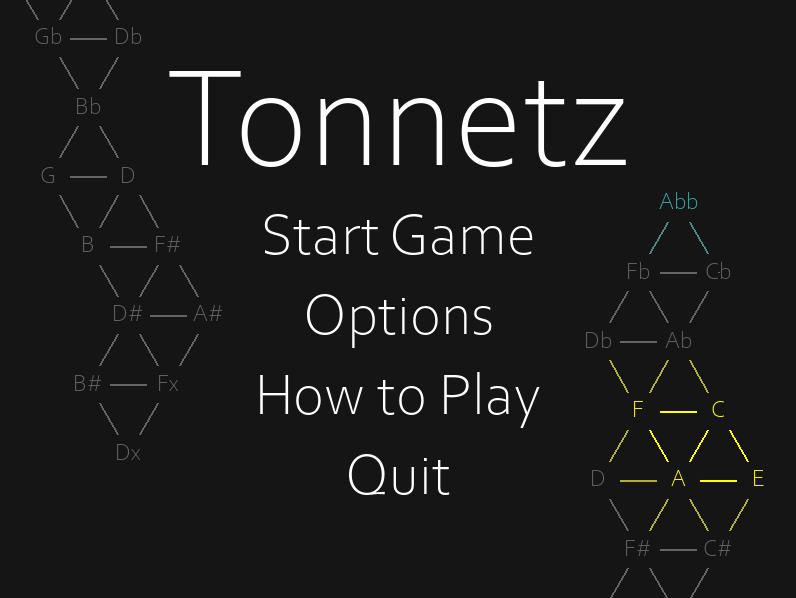
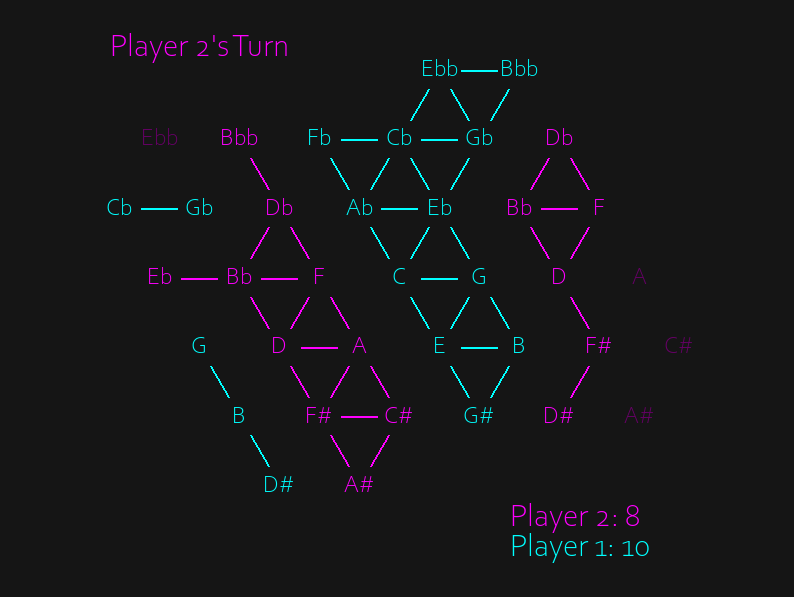

# Tonnetz

> A musical board game, where players fight for control of the soundtrack

## About
Tonnetz is a board game inspired by my background in Music Theory. Players take turns capturing nodes on a pitch lattice called the Tonnetz, in an attempt to form harmonies and earn points. No knowledge of music is required to play. It was a joy to write the soundtrack :)

## Features
- Offline Multiplayer
- Singleplayer vs AI
  - AI uses a combination of depth limited Alpha-Beta pruning tree search, as well as a custom algorithm I built for the game
- Multiple board setups for more replay value
- Customizable player colors
- Options to customize ping sound effects

## Screenshots

## Download / Play
Considering releasing it to steam for 1$, depends where things go the next few weeks.

## Built With
- PyGame
- MuseScore 4

